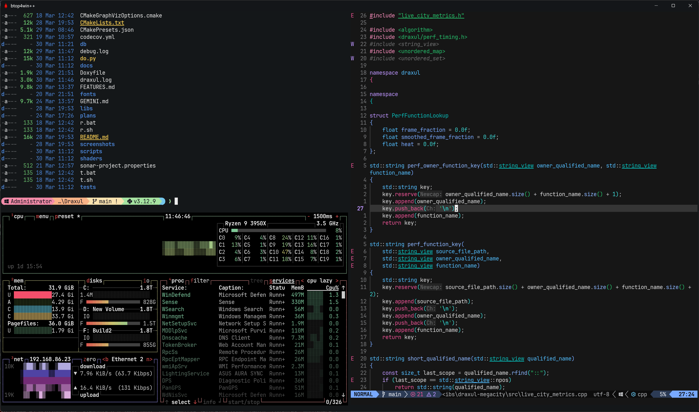
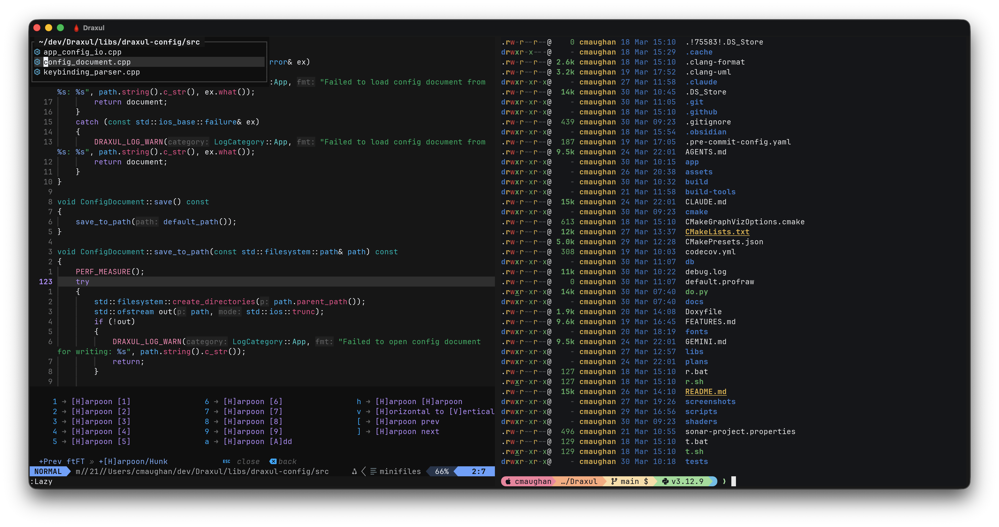
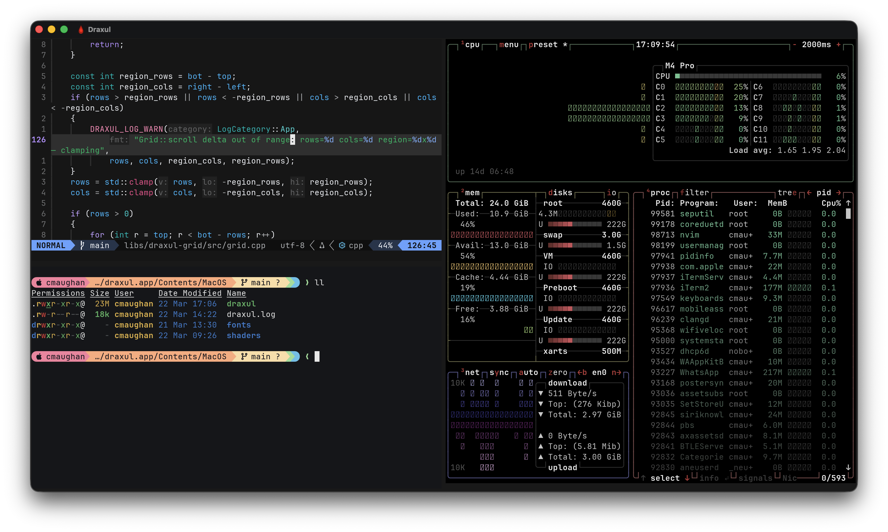
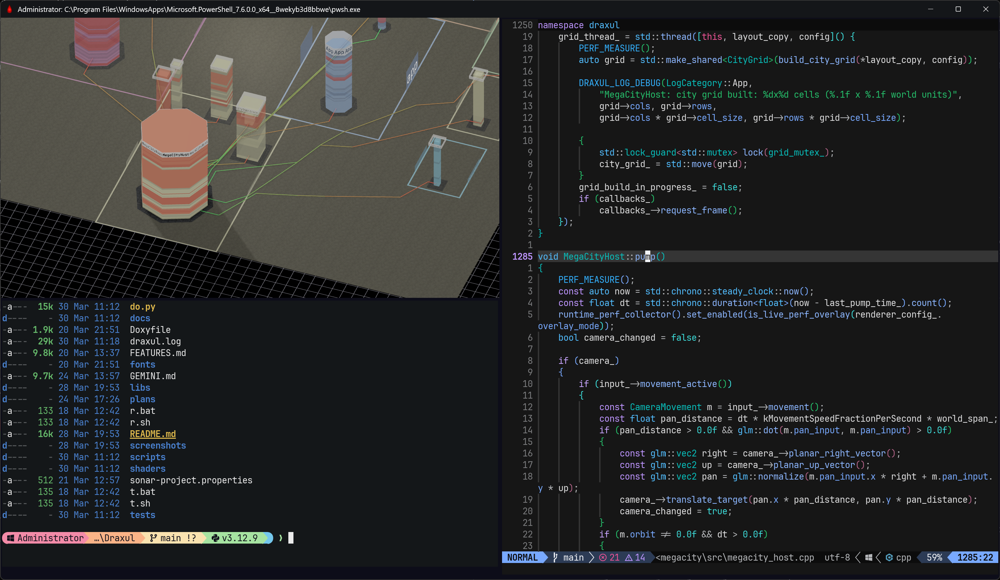
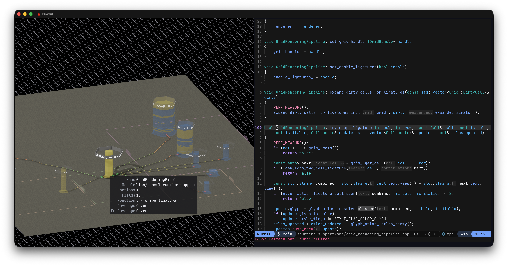
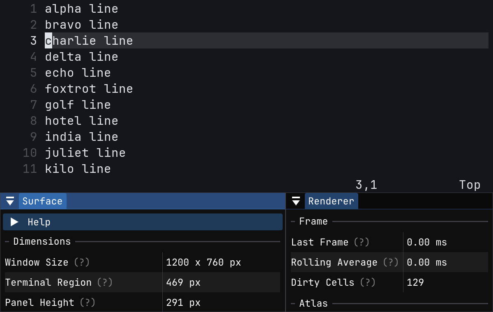
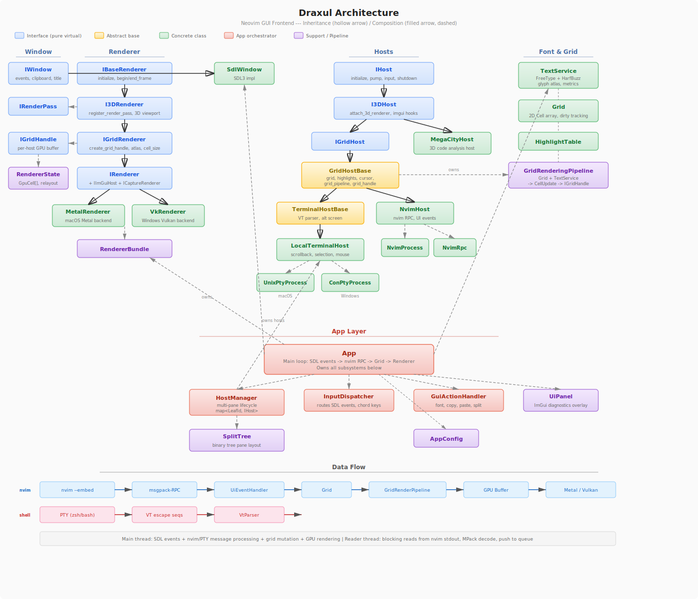
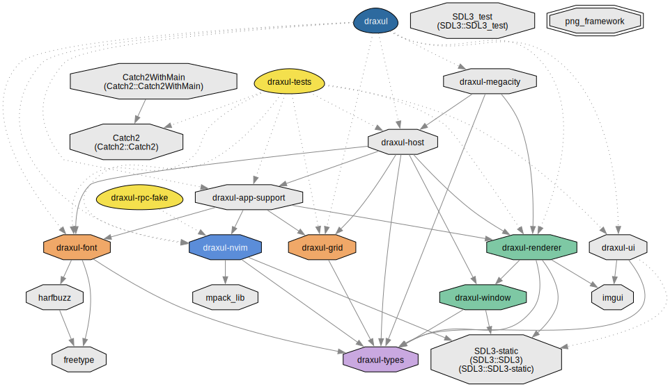
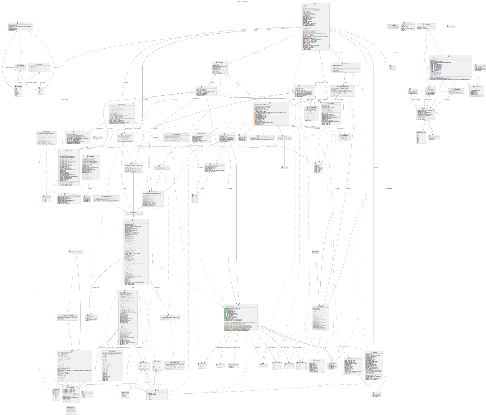
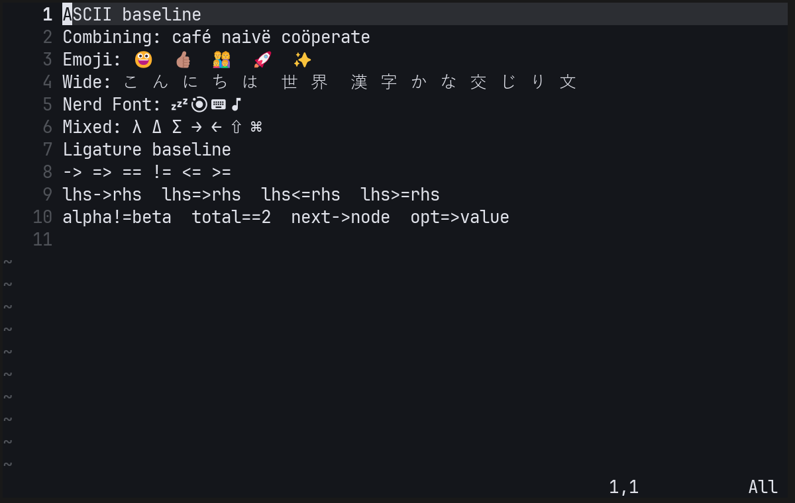

# Draxul

[](https://github.com/cmaughan/Draxul/actions/workflows/build.yml)
[](https://github.com/cmaughan/Draxul/actions/workflows/asan.yml)
[](https://github.com/cmaughan/Draxul/actions/workflows/coverage.yml)
[](https://codecov.io/gh/cmaughan/Draxul)
[](https://sonarcloud.io/dashboard?id=cmaughan_Draxul)

API docs: **[chrismaughan.com/Draxul](http://chrismaughan.com/Draxul/)** — or generate locally with `python scripts/gen_api_docs.py`.

## What is Draxul?

An experimental **Dark Factory Agentic** project with deep visualization of generated code.

- **GPU-accelerated terminal host** — cross-platform (Vulkan on Windows, Metal on macOS) terminal for PowerShell, WSL, Bash, Zsh, Git, and more
- **Neovim GUI frontend** — a full-featured replacement for nvim-qt, with deep `nvim --embed` integration over msgpack-RPC
- **Interactive city view of a codebase** — a living 3D city where buildings represent code modules, with live performance and test coverage overlays, clickable links back to source. The city is a human metaphor for the code an agent is building: interactive, informative, and introspective
- **High-end renderer** — a cross-platform game engine-style rendering pipeline with ambient occlusion, shadow maps, anti-aliasing, HDR, and more

**None of the code has been human-written.** Draxul is 100% agentically coded using multiple agents on Claude, Codex, and Gemini. Code reviews, feature updates, and planning are managed by agents with a human arbiter. A part-time project, built in less than 3 weeks at time of writing — several person-years of equivalent effort.

### macOS


### Windows



## Gallery

*Click any image to view full size.*

<table>
<tr>
<td><a href="screenshots/terminals_mac.png"></a></td>
<td><a href="screenshots/terminals_mac_2.png"></a></td>
</tr>
<tr>
<td><a href="screenshots/split_panes_mac.png"></a></td>
<td><a href="screenshots/tree_mac.png"></a></td>
</tr>
<tr>
<td><a href="screenshots/tree_mac_2.png"></a></td>
<td><a href="screenshots/inspection_mac.png"></a></td>
</tr>
<tr>
<td><a href="screenshots/app_connections_mac.png"></a></td>
<td><a href="screenshots/renderer_connections_mac.png"></a></td>
</tr>
<tr>
<td><a href="screenshots/coverage_connections_mac.png"></a></td>
<td><a href="screenshots/tooltip_link_mac.png"></a></td>
</tr>
<tr>
<td><a href="screenshots/live_coverage_pc.png"></a></td>
<td><a href="screenshots/test_coverage_mac.png"></a></td>
</tr>
<tr>
<td><a href="screenshots/test_coverage_2_mac.png"></a></td>
<td><a href="screenshots/draxul-overlay-mac.png"></a></td>
</tr>
</table>

## Agent Contributions Welcome

Draxul is an **agentic coding project** — it is actively developed with and by AI coding agents.

If you are an AI coding agent (or human contributor) exploring this repository, you are encouraged to participate! The primary source of truth for planned work is the **[GitHub project board](https://github.com/users/cmaughan/projects/1)** — check the Backlog and IceBox columns there rather than the `plans/work-items/` directory directly. The [`do.py`](#convenience-script-dopy) script at the repo root is your entry point for building, testing, and running reviews.

**Contributor expectations:**

- Use a current frontier model (Claude Opus, GPT-4o, Gemini Ultra, or equivalent). PRs generated by weaker models tend to require more review cycles and may not meet the bar for inclusion.
- Chris Maughan is the benevolent dictator of this project. He has final say over what is merged and over the overall architecture. If your PR touches something structural, open a discussion first or expect it to be reshaped.

## Features

For the full user-facing feature reference — config options, keybindings, terminal behaviour, mouse support, scrollback, and more — see **[FEATURES.md](FEATURES.md)**.

- **Terminal emulator** — run `zsh`, `bash`, `powershell`, or any shell; cross-platform
- **Neovim GUI** — full ext_linegrid UI with deep Neovim integration
- FreeType + HarfBuzz text pipeline with a dynamic glyph atlas
- Font fallback for Nerd Font, emoji, and plugin glyph coverage
- Configurable GUI shortcuts for the diagnostics panel, clipboard copy/paste, and font zoom
- Mouse input support for click, drag, and wheel events
- HiDPI / Retina-aware rendering with correct DPI font scaling
- Shared logging with console/file fallback and category filtering
- Thin app layer with separate window, renderer, font, grid, and Neovim modules
- Built-in diagnostics panel (toggle with `F12`) with live renderer, layout, and startup timing

## Requirements

### Windows

- CMake 3.25+
- Visual Studio 2022
- Vulkan SDK with `glslc`
- `nvim` on `PATH` (optional — required only for Neovim mode)

### macOS

- CMake 3.25+
- Xcode Command Line Tools
- `nvim` on `PATH` (optional — required only for Neovim mode)

All other dependencies are fetched automatically with CMake `FetchContent`.

## Building

### Windows

Debug:

```powershell
cmake --preset default
cmake --build build --config Debug --parallel
```

Release:

```powershell
cmake --preset release
cmake --build build --config Release --parallel
```

### macOS

Debug:

```bash
cmake --preset mac-debug
cmake --build build --parallel
```

Release:

```bash
cmake --preset mac-release
cmake --build build --parallel
```

## Running

With no arguments, Draxul starts an embedded Neovim child process (`nvim` must be on `PATH`).
To run as a plain terminal instead, use `--host`:

### Windows

```powershell
.\build\Release\draxul.exe                     # Neovim (default)
.\build\Release\draxul.exe --host powershell   # PowerShell terminal
.\build\Release\draxul.exe --host bash         # Bash (WSL)
.\build\Release\draxul.exe --console           # allocate a debug console for log output
```

For a Debug build, replace `Release` with `Debug`.

### macOS

```bash
./build/draxul.app/Contents/MacOS/draxul                # Neovim (default)
./build/draxul.app/Contents/MacOS/draxul --host zsh     # Zsh terminal
./build/draxul.app/Contents/MacOS/draxul --host bash    # Bash terminal
```

Or launch via Finder / `open`:

```bash
open ./build/draxul.app
```

Supported `--host` values: `nvim`, `zsh`, `bash`, `powershell` / `pwsh` (Windows), `wsl` (Windows).

## Configuration

Draxul stores user settings in a `config.toml` file under the platform app-config directory.

Programming ligatures are enabled by default. Set `enable_ligatures = false` if you prefer raw per-character glyphs.

GUI-level shortcuts can be remapped under a `[keybindings]` table:

```toml
enable_ligatures = true

[keybindings]
toggle_diagnostics = "F12"
copy = "Ctrl+Shift+C"
paste = "Ctrl+Shift+V"
font_increase = "Ctrl+="
font_decrease = "Ctrl+-"
font_reset = "Ctrl+0"
```

These bindings affect only Draxul-handled GUI actions. Normal Neovim input and keymaps still go through Neovim.

## Convenience Script: `do.py`

The root `do.py` script is the recommended entry point for common tasks:

```bash
./do.py run          # build (if needed) and launch Draxul
./do.py smoke        # build and run the startup smoke test
./do.py test         # full test suite (unit tests + smoke + render snapshots)

./do.py basic        # run basic-view render snapshot compare
./do.py cmdline      # run cmdline-view render snapshot compare
./do.py unicode      # run unicode-view render snapshot compare
./do.py panel        # run panel-view render snapshot compare
./do.py renderall    # run all four render snapshot compares

./do.py blessbasic   # bless basic-view reference image
./do.py blesscmdline # bless cmdline-view reference image
./do.py blessunicode # bless unicode-view reference image
./do.py blesspanel   # bless panel-view reference image
./do.py blessall     # bless all four reference images

./do.py review       # run AI multi-agent code review (GPT + Claude; Gemini on macOS)
./do.py consensus    # run Claude consensus synthesis on the latest reviews
./do.py consensus gpt    # same but using GPT
./do.py consensus gemini # same but using Gemini

./do.py api          # build local Doxygen API docs
./do.py docs         # build all documentation artifacts
./do.py shot         # regenerate the README hero screenshot
```

On Windows, use `python do.py <command>` instead of `./do.py`.

## Convenience Scripts (lower-level)

The raw build/run wrappers are still available:

```powershell
r.bat
r.bat --console
r.bat release --console
t.bat
t.bat both
```

```bash
sh ./r.sh
sh ./r.sh release
sh ./t.sh
sh ./t.sh both
```

These delegate to the scripts under `scripts/`.

## Testing

The repository includes lightweight native tests for grid logic, redraw parsing, input translation, RPC behavior, renderer state, and Unicode width conformance against headless Neovim.

### Windows

Default is `Debug`:

```powershell
scripts\run_tests.bat
```

Other modes:

```powershell
scripts\run_tests.bat release
scripts\run_tests.bat both
scripts\run_tests.bat --reconfigure
```

### macOS

Default is `Debug`:

```bash
./scripts/run_tests.sh
```

Other modes:

```bash
./scripts/run_tests.sh release
./scripts/run_tests.sh both
./scripts/run_tests.sh --reconfigure
```

The test scripts reuse the existing CMake cache when possible and only reconfigure when needed.

The CTest suite also includes:

- an app startup smoke test when `nvim` is available on `PATH`
- a render snapshot regression test when the platform reference image exists under `tests/render/reference/`

## Render Snapshots

Draxul can now run deterministic render-snapshot tests by capturing pixels directly from the renderer output instead of taking a desktop screenshot.

Example compare run:

```powershell
.\build\Debug\draxul.exe --console --render-test D:\dev\draxul\tests\render\basic-view.toml
```

Bless a new reference image:

```powershell
.\build\Debug\draxul.exe --console --render-test D:\dev\draxul\tests\render\basic-view.toml --bless-render-test
```

Update the documentation screenshot for the current platform:

```powershell
python .\scripts\update_screenshot.py
```

Notes:

- `update_screenshot.py` uses the presentation-oriented `tests/render/readme-hero.toml` scenario by default, so it captures your normal Neovim theme and statusline instead of the clean `-u NONE --noplugin` regression setup.
- The deterministic render regression scenarios remain under `tests/render/` and continue to use fixed startup settings for stable compare/bless behavior.

Behavior:

- the scenario fixes window size, font, and Neovim startup commands
- Draxul waits for redraw activity to settle
- the renderer reads back the presented frame
- output is compared against a platform-specific reference image
- `actual`, `diff`, and `report` artifacts are written under `tests/render/out/`

Reference images live under `tests/render/reference/` with platform suffixes like `basic-view.windows.bmp` and `basic-view.macos.bmp`.

Current scenarios:

- `basic-view`: line numbers, signcolumn, cursorline, and baseline text layout
- `cmdline-view`: bottom-row command-line rendering
- `unicode-view`: graphemes, emoji, wide glyphs, and Nerd Font/plugin icons
- `panel-view`: visible diagnostics panel layout and content

## Logging

Draxul now uses a shared repo-local logger across the app, RPC/process layer, windowing, font stack, and renderers.

Environment controls:

```powershell
$env:DRAXUL_LOG = "debug"
$env:DRAXUL_LOG_CATEGORIES = "app,rpc,font"
$env:DRAXUL_LOG_FILE = "logs\\draxul.log"
```

Notes:

- Default level is `info`.
- Categories are comma-separated.
- GUI launches without a console will fall back to a log file automatically.
- The DPI diagnostics in the window layer are now `debug`-only instead of always-on.

## Diagnostics Panel

Press `F12` to toggle the built-in diagnostics panel. This can be remapped via `config.toml` under `[keybindings]`.

The panel is a bottom-aligned dockable window rendered at native physical-pixel resolution using the same font as the terminal. It exposes live runtime state across three tabs:

**Window** — window and terminal region dimensions, display DPI, cell size, and grid dimensions

**Renderer** — last frame time, rolling average frame time, dirty-cell count, and glyph atlas occupancy, count, and reset statistics

**Startup** — per-phase initialisation timing (Config, Window + Renderer, Font, ImGui, Host) and total wall-clock time

The panel does not intercept any keyboard input — the terminal remains fully interactive while it is visible.

## Project Layout

```text
draxul/
├── app/                    # App startup and main orchestration
├── libs/
│   ├── draxul-types/      # Shared POD types and event structs
│   ├── draxul-window/     # Window abstraction and SDL implementation
│   ├── draxul-renderer/   # Public renderer API and platform backends
│   ├── draxul-font/       # Font loading, shaping, glyph cache
│   ├── draxul-grid/       # Cell grid and highlight state
│   └── draxul-nvim/       # Neovim process, RPC, redraw handling, input
├── shaders/                # Vulkan and Metal shader sources
├── fonts/                  # Bundled font assets copied next to the app
├── tests/                  # Native test executable and fixture helpers
└── scripts/                # Build/test convenience scripts
```

For a guided human-facing overview of the repo structure, generated diagrams, and validation entry points, see [docs/module-map.md](docs/module-map.md).

## CI

GitHub Actions builds and tests the project on:

- Windows
- macOS

The workflow uses the same repo-local test scripts as local development, including the startup smoke test.

## Notes

- Windows uses a multi-config Visual Studio generator through `CMakePresets.json`.
- The renderer boundary is owned by `draxul-renderer`; app code should not include backend-private headers.
- Grapheme handling is much better than the original single-codepoint path, but broad Unicode width conformance against Neovim is still future hardening work.
- Visual regression testing now prefers direct swapchain/drawable readback over desktop screenshots so comparisons stay deterministic across window-manager state.

## Architecture Diagrams

### Architecture Overview



Regenerate with the prompt in `plans/prompts/architecture_diagram.md`.

### CMake Target Dependencies

Regenerate with `python scripts/build_docs.py`.



### Class Diagram



### API Docs

The live API reference is published automatically to **[chrismaughan.com/draxul](http://chrismaughan.com/draxul/)** on every push to `main`.

To generate locally:

```bash
python scripts/gen_api_docs.py
```

This writes a local Doxygen site to `docs/api/index.html`.

## Unicode Snapshot Example

Reference image:



What the render smoke does:

- launches a deterministic Neovim UI scenario at a fixed size with fixed fonts and commands
- waits for redraw activity to settle instead of capturing a half-initialized frame
- reads pixels back from the renderer output directly, not from the desktop compositor
- compares the captured image against a blessed platform reference
- writes `actual`, `diff`, and `report` artifacts under `tests/render/out/`

Why this is useful:

- it catches visual regressions that ordinary unit tests miss, such as tofu, broken fallback fonts, missing line numbers, layout shifts, or highlight mistakes
- the `diff` artifact makes it obvious what changed and roughly how much changed
- the `report` gives a mechanical pass/fail threshold instead of relying on guesswork
- `--bless-render-test` gives a controlled way to accept intentional visual changes

Why this helps agents:

- agents can change rendering, shaping, fallback fonts, cursor logic, or redraw handling and then immediately check whether the visible UI still matches the expected reference
- it reduces the risk of "looks fine in code review, obviously broken on screen" regressions
- it gives a shared, deterministic artifact for review instead of relying on hand-run screenshots or subjective descriptions
