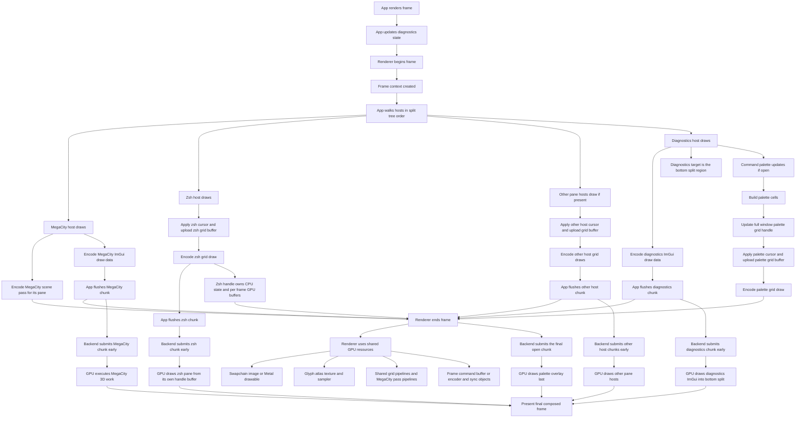

# Rendering Flowchart

Open this file directly in Obsidian for a full-page Mermaid view.

```mermaid
flowchart TD
    App[App renders frame] --> Update[App updates diagnostics state]
    Update --> Begin[Renderer begins frame]
    Begin --> Frame[Frame context created]

    Frame --> Hosts[App walks hosts in split tree order]

    Hosts --> Mega[MegaCity host draws]
    Mega --> Mega3D[Encode MegaCity scene pass for its pane]
    Mega --> MegaUI[Encode MegaCity ImGui draw data]
    MegaUI --> MegaFlush[App flushes MegaCity chunk]

    Hosts --> Zsh[Zsh host draws]
    Zsh --> ZshGrid[Apply zsh cursor and upload zsh grid buffer]
    ZshGrid --> ZshDraw[Encode zsh grid draw]
    ZshDraw --> ZshFlush[App flushes zsh chunk]
    ZshDraw --> ZshBuf[Zsh handle owns CPU state and per frame GPU buffers]

    Hosts --> Other[Other pane hosts draw if present]
    Other --> OtherGrid[Apply other host cursor and upload grid buffer]
    OtherGrid --> OtherDraw[Encode other host grid draws]
    OtherDraw --> OtherFlush[App flushes other host chunk]

    Hosts --> Diag[Diagnostics host draws]
    Diag --> DiagUI[Encode diagnostics ImGui draw data]
    DiagUI --> DiagFlush[App flushes diagnostics chunk]
    Diag --> DiagRegion[Diagnostics target is the bottom split region]

    Diag --> PalPump[Command palette updates if open]
    PalPump --> PalCells[Build palette cells]
    PalCells --> PalGrid[Update full window palette grid handle]
    PalGrid --> PalUpload[Apply palette cursor and upload palette grid buffer]
    PalUpload --> PalDraw[Encode palette grid draw]

    Mega3D --> End[Renderer ends frame]
    MegaFlush --> End
    ZshBuf --> End
    OtherFlush --> End
    DiagFlush --> End
    PalDraw --> End

    End --> Shared[Renderer uses shared GPU resources]
    Shared --> Swap[Swapchain image or Metal drawable]
    Shared --> Atlas[Glyph atlas texture and sampler]
    Shared --> Pipelines[Shared grid pipelines and MegaCity pass pipelines]
    Shared --> Sync[Frame command buffer or encoder and sync objects]

    MegaFlush --> ChunkA[Backend submits MegaCity chunk early]
    ZshFlush --> ChunkB[Backend submits zsh chunk early]
    OtherFlush --> ChunkC[Backend submits other host chunks early]
    DiagFlush --> ChunkD[Backend submits diagnostics chunk early]
    End --> Final[Backend submits the final open chunk]
    ChunkA --> GPU3D[GPU executes MegaCity 3D work]
    ChunkB --> GPUZsh[GPU draws zsh pane from its own handle buffer]
    ChunkC --> GPUOther[GPU draws other pane hosts]
    ChunkD --> GPUDiag[GPU draws diagnostics ImGui into bottom split]
    Final --> GPUPal[GPU draws palette overlay last]

    GPU3D --> Present[Present final composed frame]
    GPUZsh --> Present
    GPUOther --> Present
    GPUDiag --> Present
    GPUPal --> Present
```
