# Rendering Lifecycle

Single-frame timeline when MegaCityHost, Zsh terminal, DiagnosticsPanel, and CommandPalette are all active.

```mermaid
flowchart TD
    RF["<b>App::render_frame()</b>"]
    DIAG["Update diagnostics panel state"]
    SCROLL["Apply scroll offset to focused host"]
    BF["<b>begin_frame()</b> — acquire swapchain / drawable"]

    RF --> DIAG --> SCROLL --> BF

    WALK["Walk hosts in split-tree order"]
    BF --> WALK

    %% ── MegaCity ─────────────────────────────────────
    M1["MegaCity: generate 3D scene geometry<br/><i>host owns IRenderPass + scene state</i>"]
    M2["MegaCity: record_prepass — off-screen 3D render"]
    M3["MegaCity: record — composite 3D into pane viewport"]
    M4["MegaCity: build ImGui draw lists<br/><i>host owns ImGui context</i>"]
    M5["MegaCity: render_imgui — encode UI draw data"]
    F1["flush_submit_chunk()"]

    WALK --> M1 --> M2 --> M3 --> M4 --> M5 --> F1

    %% ── Zsh ──────────────────────────────────────────
    Z1["Zsh: apply cursor state to grid"]
    Z2["Zsh: upload dirty cells to GPU buffer<br/><i>host owns IGridHandle + per-frame buffer</i>"]
    Z3["Zsh: draw_grid_handle — encode BG + FG instanced draw<br/><i>uses shared atlas + grid pipelines</i>"]
    F2["flush_submit_chunk()"]

    F1 --> Z1 --> Z2 --> Z3 --> F2

    %% ── Diagnostics ──────────────────────────────────
    D1["Diag: build diagnostics ImGui frame<br/><i>host owns UiPanel + ImGui context</i>"]
    D2["Diag: render_imgui — encode into bottom split region"]
    F3["flush_submit_chunk()"]

    F2 --> D1 --> D2 --> F3

    %% ── Command Palette ──────────────────────────────
    P1["Palette: pump — filter + build palette cells"]
    P2["Palette: update full-window grid handle<br/><i>host owns lazily-created IGridHandle</i>"]
    P3["Palette: apply cursor + upload grid buffer"]
    P4["Palette: draw_grid_handle — encode overlay grid<br/><i>uses shared atlas + grid pipelines</i>"]

    F3 --> P1 --> P2 --> P3 --> P4

    %% ── Submission ───────────────────────────────────
    EF["<b>end_frame()</b> — close encoder / command buffer"]
    SUB["Backend submits command buffer"]

    P4 --> EF --> SUB

    %% ── GPU ──────────────────────────────────────────
    GPU_3D["GPU: MegaCity 3D prepass + composite"]
    GPU_MUI["GPU: MegaCity ImGui"]
    GPU_ZSH["GPU: Zsh grid — BG quads then FG glyphs"]
    GPU_DIAG["GPU: diagnostics ImGui in bottom split"]
    GPU_PAL["GPU: palette overlay grid — drawn last"]
    PRESENT["<b>Present</b>"]

    SUB --> GPU_3D --> GPU_MUI --> GPU_ZSH --> GPU_DIAG --> GPU_PAL --> PRESENT

    %% ── Shared resources (side note) ─────────────────
    SHARED["Shared renderer-owned resources:<br/>swapchain &#8226; glyph atlas 2048x2048 &#8226; grid pipelines BG+FG<br/>frame cmd buffer &#8226; sync objects (2 frames in flight)"]
    SHARED -.- BF
    SHARED -.- SUB

    %% ── Styles ───────────────────────────────────────
    classDef app fill:#2196F3,stroke:#1565C0,color:#fff,font-weight:bold
    classDef mega fill:#9C27B0,stroke:#6A1B9A,color:#fff
    classDef zsh fill:#4CAF50,stroke:#2E7D32,color:#fff
    classDef diag fill:#FF9800,stroke:#E65100,color:#fff
    classDef pal fill:#009688,stroke:#00695C,color:#fff
    classDef gpu fill:#37474F,stroke:#263238,color:#fff
    classDef shared fill:#E91E63,stroke:#AD1457,color:#fff
    classDef flush fill:#78909C,stroke:#455A64,color:#fff,font-style:italic

    class RF,DIAG,SCROLL,BF,WALK,EF,SUB app
    class M1,M2,M3,M4,M5 mega
    class Z1,Z2,Z3 zsh
    class D1,D2 diag
    class P1,P2,P3,P4 pal
    class GPU_3D,GPU_MUI,GPU_ZSH,GPU_DIAG,GPU_PAL,PRESENT gpu
    class SHARED shared
    class F1,F2,F3 flush
```

## Legend

| Color | Meaning |
|-------|---------|
| **Blue** | App orchestration — frame lifecycle, host walking |
| **Purple** | MegaCityHost — 3D scene geometry + ImGui |
| **Green** | Zsh terminal host — grid cell upload + instanced draw |
| **Orange** | DiagnosticsPanelHost — ImGui panel in bottom split |
| **Teal** | CommandPaletteHost — overlay grid (drawn last) |
| **Coral/Pink** | Shared renderer-owned GPU resources |
| **Dark Slate** | GPU execution — what the hardware actually runs |
| **Grey** | `flush_submit_chunk()` — encoding boundary between hosts |

## Key Ownership

- **Grid hosts** (Zsh, Palette) each own an `IGridHandle` with CPU-side `RendererState` + per-frame GPU buffers. They generate cells, upload, and encode instanced BG+FG draws against the shared grid pipelines and glyph atlas.
- **MegaCityHost** owns its `IRenderPass` and scene state. Records a prepass (off-screen 3D) then composites into its pane, plus its own ImGui overlay.
- **DiagnosticsPanel** owns a `UiPanel` and ImGui context. Only encodes `render_imgui()` into the bottom split.
- **The renderer** owns shared resources: swapchain, atlas, pipelines, command buffer, sync. Provides `begin_frame()` / `end_frame()` but never decides *what* to draw.
