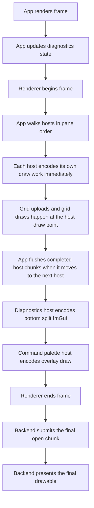
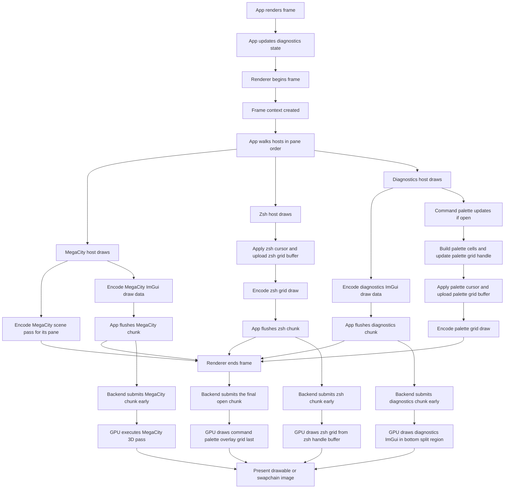

# Rendering Flow

This is the current render architecture after the per-host immediate draw refactor.

## Ownership

- `App` orchestrates frame order.
- `HostManager` owns pane hosts in split-tree order.
- Each grid-capable host owns its own `IGridHandle`.
- Each `IGridHandle` owns its own per-frame GPU grid buffer.
- `MegaCityHost` owns its scene pass and records its own 3D work.
- `DiagnosticsPanelHost` owns the diagnostics ImGui panel.
- `CommandPaletteHost` owns the palette grid handle and draws last as an overlay.
- The renderer owns only global/shared GPU resources plus frame lifecycle:
  - swapchain / drawable
  - frame command buffer / encoder
  - glyph atlas texture + sampler
  - grid pipelines
  - backend frame synchronization objects

## High-Level Loop

For a larger standalone diagram, open [rendering-flowchart.md](/Users/cmaughan/dev/Draxul/docs/architecture/rendering-flowchart.md) directly in Obsidian.

## Example: MegaCity + Zsh Split

If the split tree is:

- left: `MegaCityHost`
- right: `Zsh` terminal host

and diagnostics is visible, with the command palette open, the effective draw order is:

1. `MegaCityHost::draw(frame)`
2. `ZshHost::draw(frame)`
3. `DiagnosticsPanelHost::draw(frame)`
4. `CommandPaletteHost::draw(frame)`
5. `renderer->end_frame()`

That means:

- MegaCity records its 3D pass and its host-local ImGui.
- Zsh records its pane-local grid draw.
- The app flushes MegaCity and zsh as completed chunks before moving on.
- Diagnostics records panel ImGui into the bottom split region.
- Command palette records its full-window overlay grid on top of everything.

## Detailed Flow

## GPU Objects By Content Type

### Shared renderer-owned objects

- swapchain images / Metal drawable
- frame command buffer or Metal command buffer
- glyph atlas texture
- glyph atlas sampler
- grid background pipeline
- grid foreground pipeline
- Vulkan descriptor pool for per-handle descriptor sets
- per-frame synchronization objects

### Terminal / grid host objects

Each grid host owns:

- CPU-side `RendererState`
- pane viewport / scissor rectangle
- per-frame GPU grid buffer
  - Metal: one `MTLBuffer` per frame slot
  - Vulkan: one `VkGridBuffer` per frame slot
- Vulkan only: per-frame background / foreground descriptor sets

At draw time the host calls `draw_grid_handle(handle)`, and the backend immediately:

- the handle's own GPU buffer
- the shared atlas texture/sampler
- the shared grid pipelines

and draws that handle with `baseInstance / firstInstance = 0`.

### MegaCity objects

`MegaCityHost` owns:

- scene/world/camera state
- `IRenderPass` implementation for the scene
- any MegaCity-specific GPU resources managed by that pass
- MegaCity ImGui context + draw data

At draw time it records:

- `record_render_pass(...)` for 3D
- `render_imgui(...)` for MegaCity UI

### Diagnostics panel objects

`DiagnosticsPanelHost` owns:

- `UiPanel`
- diagnostics ImGui context
- dockspace/window state

It records only:

- `render_imgui(...)`

### Command palette objects

`CommandPaletteHost` owns:

- palette state / filtering state
- one lazily-created full-window `IGridHandle`

When open, it:

1. computes palette cells
2. updates its own grid handle
3. records `draw_grid_handle(...)`

## Backend Chunked Submission Model

Both Metal and Vulkan now follow the same pattern:

1. `begin_frame()` acquires the frame target and returns an `IFrameContext`.
2. Hosts encode their draws immediately into the live frame context.
3. Grid hosts apply cursor state and upload their own dirty grid data at draw time.
4. The app flushes completed host chunks at host boundaries so the backend can submit earlier work while the CPU continues encoding later hosts.
5. `end_frame()` submits the final open chunk and presents the composed frame.

That is the key architectural boundary:

- `App` decides ordering.
- Hosts decide what to draw.
- The renderer manages live frame/device concerns plus chunk submission.
